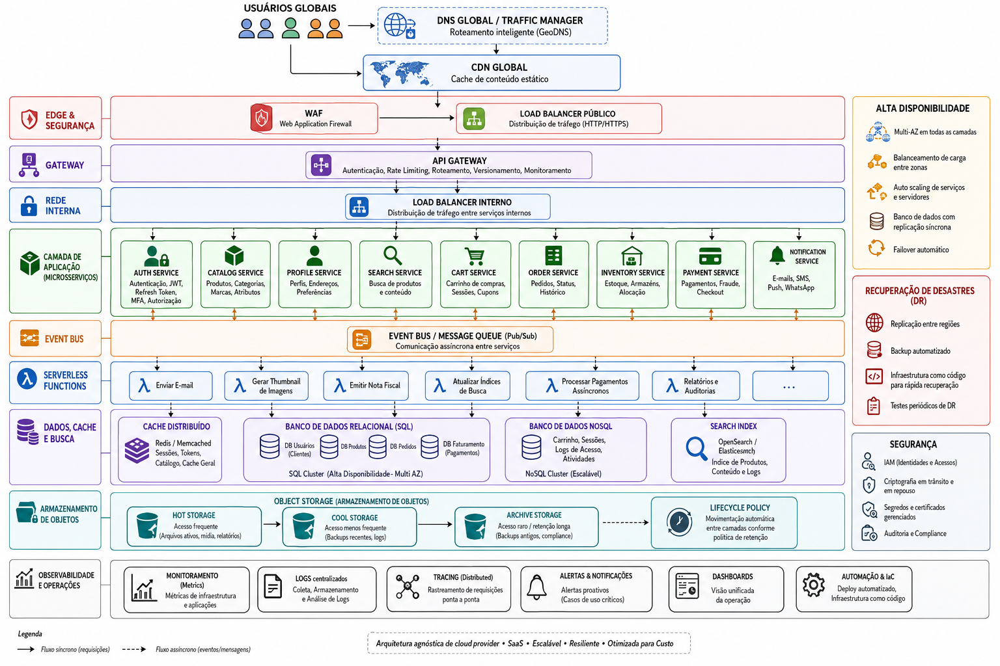

# DevOps & Arquitetura Cloud
## Challenge Phase 1 - Module 2
### Arquitetura Cloud para Plataforma Global de E-Commerce

**Aluno:** Eric Ferreira Motta  
**Curso:** Pós-Graduação em DevOps & Arquitetura Cloud  
**Disciplina:** DevOps & Arquitetura Cloud

## Desafio Proposto
Desenvolver uma arquitetura cloud para a startup "InovaSoluções Tech" que está prestes a lançar uma plataforma global de e-commerce. Esta plataforma deve ser altamente disponível, escalável para lidar com picos sazonais (Black Friday, Lançamentos e eventos), segura para proteção dos dados de usuários e transações de pagamento, otimizada em custos para que a sustentabilidade do ambiente cloud seja factível.
Baixa latência é um requisito em todas as conexões oriundas de diversos continentes.

---

## Pontos Críticos
O novo portal de e-commerce é um portal de alta criticidade, onde uma abordagem monolitica não é indicada. Portanto, a modelagem foi efetuada visando pontos com responsabilidades independentes.

### Escolha Cloud
A estrutura apresentada na imagem anterior é agnostica a qualquer provedor. Portanto, todos os serviços aqui presentes existem nos maiores provedores cloud com diferentes nomes.
O Microsoft Azure foi escolhido devido à combinação entre presença global, amplo portfólio de serviços PaaS, integração com o ecossistema Microsoft e experiência operacional da equipe.

#### Vantagens:
- Integração com o ambiente Microsoft 365, facilitando o gerenciamento.
- Cobertura mundial.
- Compliance e certificações globais.

#### Desvantagens:
- Custo levemente mais alto que as outras principais fornecedoras.
- Custos variam em diferentes regiões.

**Tabela Comparativa**

| Categoria | AWS | Azure | GCP |
|---|---|---|---|
| Compute (VMs) | On-demand: ~$0,2016/h (4 vCPU, 16 GB RAM). Savings Plans até 72% de desconto. | On-demand: ~$0,192/h. Reservas até 72% de desconto. | On-demand: ~$0,1942/h. CUDs até 70% + descontos automáticos de até 30%. |
| Storage (Object) | S3 Standard: ~$0,0207/GB-mês. | Blob Hot: ~$0,018/GB-mês (mais barato). | Cloud Storage Standard: ~$0,020/GB-mês. |
| Egress (saída de dados) | $0,09/GB (100 GB grátis). | $0,087/GB (10 GB grátis). | $0,08/GB (100 GB grátis). |
| Banco de Dados Gerenciado (PostgreSQL HA) | ~$835/mês. | ~$424/mês (redução de 20% em 2026). | ~$364/mês (redução em 2025). |
| Kubernetes (K8s) | EKS: $73/mês por cluster. | AKS: gratuito (control plane). | GKE: $73/mês por cluster. |

### Estratégia MultiCloud
Uma estratégia Multi-Cloud (onde multiplos provedores de núvem são utilizados em seus pontos fortes) não são recomendados para o core do sistema, devido a implicação de alta performance e baixa latência desejadas. Porém, itens externos, como um Object Storage de outro provedor para armazenamento de backups e logs em cold storage são possíveis e até recomendados para redução de custo total.
Outro ponto também importante, é a capacidade do time de TI em interagir com Multi-Cloud. Devido a diferença presente no fornecimento e configuração de cada um dos itens da arquitetura, o desafio imposto provavelmente será maior que o benfício financeiro.

---

### Modelos de serviço a serem adotados
Para redução de complexidade gerencial, possibilidade de economia utilizando eventos e capacidade de rápida replicação, a utilização de serviços PaaS (Platform as a Service) e FaaS (Function as a Service) serão as escolhas para o projeto.
Base de dados serão gerenciadas pelo fornecedor, removendo complexidade da implementação.
Funções chamadas a partir de evento reduzem o custo operacional, sendo tarifadas apenas pelo volume de execução e não por sua existência no ambiente.
Serviço de aplicativos serão usados para Front End e API's, permitindo rápida escalação horizontal para picos sazonais ou mesmo por tráfego não esperado.
Armazenamento em bloco e objeto serão usados, mas com ciclo de vida em seus dados, para a redução de custo em massa de dados como backup e logs que não são ativamente acessados.

#### Modelo de serviços

| Componente | Modelo |
|---|---|
| Front-End | PaaS |
| APIs (MicroServiços)| PaaS |
| Event Bus | PaaS |
| Functions | FaaS |
| Banco SQL | PaaS |
| Redis | PaaS |
| Storage | PaaS |

A escolha de PaaS em todos os serviços, basicamente reflete a necessidade de rapidez e efetividade nas implementações. Portanto, o motivo das escolhas pode ser vista abaixo:

- Front-End: Serviços PaaS já possuem a configuração basica necessária para praticamente qualquer linguagem atual. Sendo necessário apenas uma configuração de performance voltada para a aplicação servida.
- APIs: Esses recursos podem receber containers personalizados, onde a aplicação foi versionada, testada e pode rapidamente aplicar conceitos de auto-heal e escala horizontal.
- Event Bus: Serviço PaaS que permite desacoplamento e comunicação assincrona entre os microserviços.
- Functions: Como as APIs, possuem abstração do ambiente fisico, sendo chamadas apenas em eventos específicos
- Banco SQL: Abstração de configuração reduz a necessidade de mão de obra especializada e aumenta a produtividade
- Redis: Ferramenta PaaS para cacheamento de dados, que reduz as consultas diretas ao banco, aumentando a performance e reduzindo a possibilidade de gargalo no recurso de database.
- Storage: Object Storage pode ser diretamente acessado pelos microserviços e funções, reduzindo a complexidade do ambiente, possui criptografia em repouso, configuração de soft delete e capacidade virtualmente ilimitada de armazenamento.

### Componentes de Infraestrutura e Arquitetura
#### Entry Points - CDN
Devido a demanda de cobertura global e redução de custos, não é viável a utilização de edge computing. Portanto a utilização de CDN é mandatória.
Por tratar-se de um e-commerce, muitas páginas são dinâmicas, impedindo o cacheamento ativo de todos os conteúdos. Porém, códigos são raramente a maior dificuldade em um carregamento de dados via web. Portanto, um cacheamento bem configurado, focando em itens grandes ou referências externas é mandatório. Então imagens, css, scripts de terceiros devem ser configurados para cacheamento.
A escolha da CDN é relativa, pois temos em todos os cloud providers atuais, uma opção disponível. Além de serviços externos como a Akamai e Cloudflare.
Visando cobertura, disponibilidade e custos, a Cloudflare é o serviço indicado, provendo tanto uma extensa rede entrega de conteúdo, como capacidades WAF e serviços de segurança e monitoramento adicionais.

#### Computação
Os recursos responsáveis pela execução da lógica do sistema. O Front-End será hospeadado em um serviço de aplicativo PaaS (como o Azure App Service). Na camada de aplicação, temos também os MicroServiços responsáveis pelo funcionamento geral do sistema E-Commerce (autenticação, catalogo, perfil, busca, carrinho e outros) e também as functions (FaaS - Serverless) sendo acionadas por eventos publicados no Event Bus ou por outros gatilhos da aplicação.

Esse tipo de abordagem reduz a complexidade de implementação, permite simples escalabilidade horizontal dos recursos e facilita a manutenção, garantindo um funcionamento seguro e confiável da aplicação.

#### Redes
A comunicação entre os componentes da arquitetura ocorrerá por meio de redes privadas virtuais (VNets), garantindo que apenas recursos autorizados possam se comunicar internamente. Serviços como bancos de dados, armazenamento, cache e demais componentes internos terão o acesso público desabilitado, sendo acessados exclusivamente por meio de Private Endpoints.

O único ponto de entrada público da aplicação será a porta TCP 443 (HTTPS), protegida por CDN, WAF e pelo balanceador de carga frontal. Todo o restante da infraestrutura permanecerá inacessível diretamente pela Internet, permitindo apenas comunicação através da rede privada. Essa abordagem reduz significativamente a superfície de ataque e implementa o princípio de Zero Trust, no qual nenhum recurso é considerado confiável por padrão e todo acesso deve ser autenticado, autorizado e validado.

#### Balanceamento de Carga
Para atender aos requisitos de escalabilidade e disponibilidade da plataforma, será utilizado um balanceador de carga de Camada 7 (Layer 7), capaz de inspecionar o tráfego HTTPS e realizar o roteamento inteligente das requisições para os microserviços responsáveis por cada funcionalidade da aplicação. Essa abordagem permite o encaminhamento baseado em URLs, cabeçalhos HTTP e outras informações da requisição, tornando a distribuição do tráfego mais eficiente.
Além da distribuição de carga, o balanceador realizará verificações periódicas de integridade (Health Checks), removendo automaticamente do roteamento instâncias que apresentem falhas.

O balanceador atuará em conjunto com o API Gateway, distribuindo as requisições entre as instâncias dos serviços e proporcionando escalabilidade horizontal, alta disponibilidade e maior resiliência durante períodos de elevada demanda, como eventos promocionais e Black Friday.

#### Banco de Dados

Os dados da plataforma serão armazenados utilizando uma combinação de bancos relacionais (SQL) e não relacionais (NoSQL), permitindo que cada tecnologia seja utilizada de acordo com suas características e requisitos de desempenho.

O banco relacional será responsável pelos dados transacionais do sistema, como usuários, catálogo de produtos, pedidos, pagamentos e controle de estoque, garantindo integridade, consistência e suporte a transações ACID. Para otimização de custos, esses bancos poderão compartilhar inicialmente uma mesma instância gerenciada, sendo separados logicamente conforme a responsabilidade de cada domínio da aplicação.

O banco NoSQL será utilizado para informações de alta volatilidade e baixa necessidade de relacionamento, como carrinhos de compras, sessões de usuários e preferências temporárias. Essa abordagem proporciona maior escalabilidade horizontal e menor latência para operações com grande volume de leitura e escrita.

Complementando a arquitetura, um serviço Redis será utilizado como camada de cache distribuído, reduzindo consultas recorrentes aos bancos de dados e melhorando significativamente o desempenho da aplicação durante períodos de alta demanda.

Essa estratégia permite utilizar a tecnologia mais adequada para cada tipo de dado, equilibrando desempenho, escalabilidade e custos operacionais.

#### Armazenamento

O armazenamento da aplicação será baseado predominantemente em Object Storage, destinado ao armazenamento de dados não estruturados, como imagens de produtos, vídeos, documentos, backups, logs e demais arquivos utilizados pela plataforma. Essa abordagem oferece alta durabilidade, escalabilidade praticamente ilimitada e integração nativa com os serviços PaaS e FaaS utilizados na arquitetura.

Não está prevista a utilização direta de armazenamento em bloco (Block Storage), uma vez que a maior parte dos componentes computacionais será executada em serviços gerenciados, abstraindo essa necessidade para o provedor de nuvem.

Para otimização de custos, devem ser implementadas políticas de Lifecycle Management, promovendo automaticamente os dados entre camadas de armazenamento (Hot, Cool e Archive) de acordo com sua frequência de acesso. Essa estratégia reduz significativamente os custos associados à retenção de backups, históricos de logs e demais informações que necessitam de longo período de armazenamento.

---

### Escalabilidade e Alta Disponibilidade
A utilização de microserviços permite uma escalabilidade granular. Em eventos de grandes proporções, como a Black Friday, é esperado um aumento significativo da carga sobre serviços como Search Service (busca de produtos), Auth Service (autenticação do portal) e Cart Service (responsável pela manutenção dos carrinhos de compra), mas não necessariamente sobre serviços como Profile Service (criação e gerenciamento de contas) ou Payment Service (processamento efetivo dos pagamentos).

Para isso, os serviços devem possuir Auto Scaling configurado com limites conservadores, permitindo que a capacidade seja ampliada conforme a demanda. Componentes cuja escalabilidade é limitada pela própria tecnologia, como bancos de dados, normalmente se beneficiam de Vertical Scaling, enquanto serviços com grande variação no volume de requisições, como Search Service e Cart Service, devem utilizar Horizontal Scaling, permitindo a criação automática de novas instâncias durante períodos de alta demanda.

Os balanceadores de carga deverão executar verificações periódicas de integridade (Health Checks), removendo automaticamente do roteamento instâncias que apresentem falhas e garantindo maior disponibilidade da aplicação. Da mesma forma, serviços PaaS normalmente possuem mecanismos automáticos de Auto Heal, reiniciando instâncias que apresentem comportamento inadequado sem necessidade de intervenção manual.

Para alta disponibilidade, existem duas abordagens principais:

**1 - Utilização de Zonas de Disponibilidade (Availability Zones - AZs)**:
Independentemente da região escolhida, devido à criticidade do ambiente, recomenda-se a utilização de múltiplas Zonas de Disponibilidade. Dessa forma, falhas localizadas em um datacenter não comprometem a operação da plataforma. A arquitetura deve ser distribuída entre, no mínimo, três instâncias da aplicação em zonas distintas, fisicamente independentes em termos de energia, rede e refrigeração, garantindo elevada disponibilidade e baixa latência entre os componentes.

**2 - Utilização de Múltiplas Regiões**:
Embora a possibilidade de indisponibilidade completa de uma região seja remota, eventos de grande impacto — como rompimento de cabos submarinos, desastres naturais ou conflitos geopolíticos — podem comprometer temporária ou permanentemente toda uma região do provedor de nuvem. Nesse cenário, a utilização de uma segunda região aumenta significativamente a resiliência da plataforma.

Entretanto, essa abordagem também apresenta desafios importantes para ambientes Active-Active, como:

Replicação assíncrona de bancos de dados, podendo gerar inconsistências temporárias de inventário;
Aumento da latência entre regiões durante cenários de balanceamento de carga;
Custos adicionais de infraestrutura e de transferência de dados entre regiões.

Como o custo é um fator crítico para a implementação inicial, recomenda-se a utilização de Zonas de Disponibilidade como estratégia de alta disponibilidade. Essa abordagem oferece um excelente equilíbrio entre disponibilidade, desempenho e custo operacional, mantendo a arquitetura preparada para uma futura expansão para um modelo Multi-Region, caso o crescimento do negócio justifique esse investimento.

### Segurança
A segurança da plataforma deverá seguir o princípio de Defense in Depth (Defesa em Profundidade), onde cada camada da arquitetura implementa mecanismos próprios de proteção, reduzindo a superfície de ataque e limitando a propagação de falhas ou acessos não autorizados.

A arquitetura também deverá adotar o modelo de Zero Trust (nenhum recurso é considerado confiável por padrão). Todo acesso deverá ser autenticado, autorizado e validado, independentemente de sua origem.

#### Controle de Acesso
O gerenciamento de identidade deverá utilizar controles de acesso baseados em papéis (RBAC), garantindo que cada colaborador possua apenas as permissões necessárias para exercer suas atividades (Princípio do Menor Privilégio). Contas administrativas deverão utilizar obrigatoriamente Autenticação Multifator (MFA), reduzindo significativamente os riscos associados ao comprometimento de credenciais.

#### Proteção da Rede
O único ponto de entrada público da aplicação deverá ser a porta TCP 443 (HTTPS), protegida por CDN, WAF e balanceamento de carga. Todos os demais componentes da arquitetura permanecerão inacessíveis diretamente pela Internet, comunicando-se exclusivamente através de redes privadas.

#### Criptografia
Todos os dados deverão permanecer criptografados tanto em trânsito quanto em repouso. Certificados digitais deverão ser utilizados para proteção das comunicações HTTPS, enquanto chaves criptográficas e segredos da aplicação deverão ser armazenados em serviços dedicados de gerenciamento de chaves e segredos.

#### Modelo de Responsabilidade Compartilhada
A arquitetura considera o Modelo de Responsabilidade Compartilhada, no qual o provedor de nuvem permanece responsável pela segurança da infraestrutura física, rede, hardware e serviços gerenciados, enquanto a equipe da aplicação permanece responsável pela proteção dos dados, configuração dos serviços, gerenciamento de identidades, controle de acessos e desenvolvimento seguro da aplicação.

---

### Otimização de Custos e Governança

A governança da plataforma deverá estabelecer padrões que garantam organização, rastreabilidade, auditoria e controle sobre todos os recursos da infraestrutura durante todo o ciclo de vida da aplicação. Além de contribuir para a segurança do ambiente, uma boa estratégia de governança facilita processos de automação, manutenção e controle financeiro.

Todos os recursos implementados deverão possuir uma estratégia padronizada de tagueamento, permitindo identificar informações como ambiente (Produção, Homologação ou Desenvolvimento), aplicação, proprietário, centro de custo, criticidade e demais informações relevantes para a operação. Essa padronização simplifica auditorias, facilita a identificação de recursos e possibilita análises mais precisas de custos.

O gerenciamento de acessos deverá seguir políticas baseadas em papéis (RBAC) e no Princípio do Menor Privilégio, garantindo que cada equipe possua apenas as permissões necessárias para desempenhar suas atividades. Dessa forma, desenvolvedores, administradores de infraestrutura, equipes de segurança e demais profissionais atuarão apenas sobre os recursos sob sua responsabilidade.

A plataforma também deverá implementar mecanismos de observabilidade, centralizando métricas, logs e eventos para acompanhamento contínuo da saúde do ambiente. Essas informações permitirão definir indicadores de nível de serviço (SLI), objetivos de nível de serviço (SLO) e acompanhar os acordos de nível de serviço (SLA), auxiliando na identificação de falhas, gargalos e oportunidades de melhoria contínua.

Por fim, recomenda-se a adoção de convenções padronizadas para nomenclatura dos recursos, documentação da infraestrutura e versionamento das configurações. Essas práticas facilitam futuras expansões da plataforma, reduzem erros operacionais e garantem maior consistência durante todo o ciclo de vida da solução. Como referência para a implementação dessas práticas, recomenda-se a consulta aos guias oficiais de arquitetura dos principais provedores de nuvem, que disponibilizam frameworks e recomendações amplamente adotadas pela indústria.

#### Referências Técnicas
- [Microsoft Azure Well-Architected Framework](https://learn.microsoft.com/azure/well-architected/)
- [AWS Well-Architected Framework](https://docs.aws.amazon.com/wellarchitected/latest/framework/welcome.html)
- [Google Cloud Architecture Framework](https://cloud.google.com/architecture/framework)
- [Oracle Cloud Infrastructure Architecture Center](https://docs.oracle.com/en/solutions/oci-best-practices/index.html)

---

## Well-Architected Framework

### Excelência Operacional

A arquitetura prioriza serviços gerenciados (PaaS/FaaS), observabilidade, monitoramento contínuo, Auto Heal e padronização da infraestrutura, reduzindo a complexidade operacional e facilitando futuras evoluções da plataforma.

### Segurança

A plataforma adota os princípios de Defense in Depth e Zero Trust, utilizando WAF, redes privadas, criptografia, MFA e controle de acesso baseado em papéis para proteger usuários, aplicações e dados.

### Confiabilidade

A utilização de múltiplas Zonas de Disponibilidade, Auto Scaling, Health Checks e comunicação assíncrona através do Event Bus garantem elevada disponibilidade e resiliência diante de falhas ou picos de demanda.

### Eficiência de Performance

A arquitetura utiliza CDN global, cache distribuído (Redis), balanceamento de carga L7, bancos SQL e NoSQL especializados e escalabilidade independente dos microserviços, reduzindo latência e melhorando a experiência dos usuários.

### Otimização de Custos

A adoção predominante de serviços PaaS e FaaS, políticas de Lifecycle Management, escalabilidade automática e a escolha inicial por Multi-AZ em vez de Multi-Region proporcionam um equilíbrio entre desempenho, disponibilidade e sustentabilidade financeira.

---

### Boas Práticas

A arquitetura proposta foi desenvolvida buscando aderência aos principais pilares do Well-Architected Framework, amplamente adotado pelos principais provedores de nuvem como referência para construção de soluções seguras, escaláveis e resilientes.

- Excelência Operacional: utilização predominante de serviços gerenciados (PaaS/FaaS), observabilidade, monitoramento contínuo, padronização da infraestrutura e mecanismos automáticos de recuperação de falhas.
- Segurança: adoção dos princípios de Defense in Depth e Zero Trust, utilizando redes privadas, WAF, autenticação multifator (MFA), controle de acesso baseado em papéis (RBAC) e criptografia para proteção dos dados.
- Confiabilidade: utilização de múltiplas Zonas de Disponibilidade, balanceamento de carga, Auto Scaling, Health Checks e comunicação assíncrona através do Event Bus para garantir elevada disponibilidade da plataforma.
- Eficiência de Performance: utilização de CDN global, cache distribuído (Redis), balanceamento Layer 7 e bancos de dados especializados (SQL e NoSQL), permitindo baixa latência e escalabilidade independente dos componentes.
- Otimização de Custos: priorização de serviços PaaS e FaaS, utilização de políticas de Lifecycle Management, escalabilidade automática e adoção inicial de múltiplas Zonas de Disponibilidade em substituição a uma arquitetura Multi-Region, equilibrando disponibilidade e sustentabilidade financeira.

Como referência para aprofundamento das práticas apresentadas, recomenda-se a consulta aos frameworks oficiais dos principais provedores de nuvem.

---

## Conclusão

A arquitetura proposta busca atender aos requisitos apresentados para a plataforma global de e-commerce, equilibrando escalabilidade, disponibilidade, segurança e otimização de custos. A adoção predominante de serviços gerenciados reduz a complexidade operacional, enquanto a utilização de microserviços, comunicação orientada a eventos e escalabilidade independente proporciona maior flexibilidade para acompanhar o crescimento da plataforma.

As decisões arquiteturais priorizaram soluções amplamente adotadas pelo mercado e independentes de um provedor específico de nuvem, permitindo que a implementação seja adaptada para diferentes ambientes cloud sem alterações significativas em sua concepção. Além disso, a utilização de padrões como Defense in Depth, Zero Trust e Well-Architected Framework contribui para a construção de um ambiente seguro, resiliente e preparado para futuras evoluções.

Embora algumas estratégias, como uma arquitetura Multi-Region, não tenham sido adotadas inicialmente devido ao impacto financeiro, a solução foi projetada para permitir sua implementação conforme o crescimento do negócio e a evolução dos requisitos de disponibilidade.

Dessa forma, a arquitetura apresentada oferece uma base sólida para o desenvolvimento de uma plataforma moderna de e-commerce, conciliando desempenho, segurança, governança e sustentabilidade operacional.

---