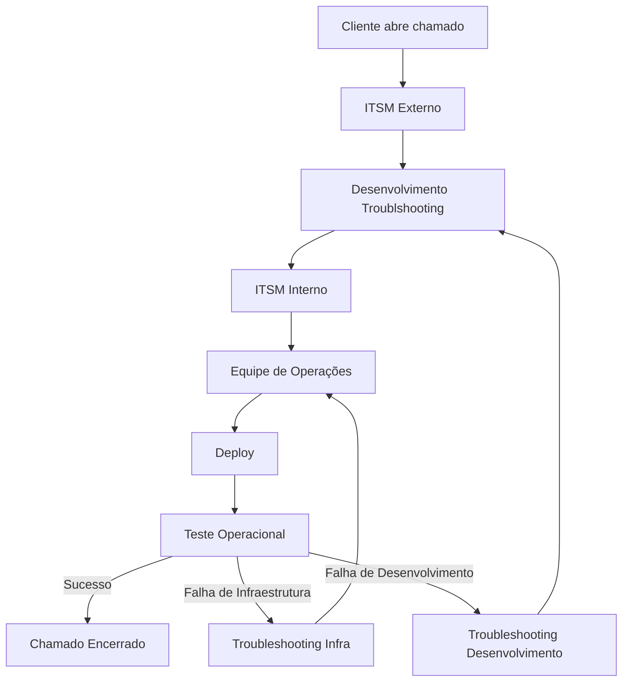
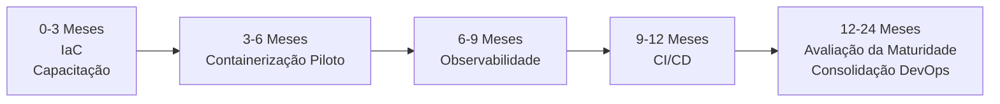

# Assessment DevOps - Challenge Phase 1

# 1. Introdução

Este documento tem como foco a análise do ambiente da empresa X-Dev, fictícia, para o desafio proposto pela FIAP, no curso de Pós Graduação Tech - DevOps & Arquitetura Cloud.
Os dados aqui expostos não se referem a nenhuma empresa, embora similaridades possam ser identificadas.

## Sobre o Autor : Eric da M. Ferreira

Eric da M. Ferreira

Analista de Infraestrutura e Cloud, atualmente cursando a Pós-Graduação Tech em DevOps & Arquitetura Cloud pela FIAP.

Este documento foi desenvolvido como parte do Assessment da Challenge Phase 1, utilizando um ambiente fictício construído a partir da consolidação de diferentes cenários encontrados na prática profissional, preservando informações confidenciais e sem representar diretamente qualquer organização específica.

## Sobre a Empresa: X-Dev

A X-Dev é uma empresa de médio porte, com menos de 500 funcionários, que oferece serviços diversos, com o maior foco em ambientes cloud Microsoft. Então, Microsoft Azure é o cloud provider mais utilizado (embora não o único).
Apesar de ser o foco, Microsoft não é a única oferta, sendo necessário então identificarmos os pontos onde podemos abordar, de maneira gradual, a implementação da cultura DevOps.
Durante algumas visitas, conversas com as equipes e entrevistas foram conduzidas, levando a identificação de um perfil cultural da empresa como o perfil de "Mercado", onde forte acompanhamento de metas e indicadores são buscados constantemente.

---

# 2. Ambiente Atual
A X-Dev é uma empresa totalmente cloud, com um escritório apenas a ser usado como base de encontro. Portanto, nenhum servidor físico está presente para ser analisado.
Dentro da proposta 100% cloud, Microsoft Azure é o cloud provider com a maior força no ambiente, devido a fácil integração entre os produtos ofertados. Mas também é utilizado outros cloud providers como a DigitalOcean para projetos de menor margem, mantendo assim um lucro estimado similar.
Atualmente, de todos os produtos ofertados, esse assessment tem como foco apenas na hospedagem oferecida pela empresa. Por não ser um produto de alta demanda, com contratos individuais, podemos gradualmente ofertar possibilidades sem grandes impactos.
A hospedagem em grande parte é ofertada com a linguagem PHP, em serviços IaaS (Infrastructure as a Service) e PaaS (Platform as a Service), de maneira heterogênea. Portanto não existe uma real padronização em como os portais são implementados.
Os contratos são todos separados por Resource Groups individuais no Azure ou projetos na DigitalOcean e poucos itens compartilham recursos.
Existe um sistema para repositório centralizado, utilizando Azure DevOps, mas apenas projetos em desenvolvimento ativo com alto valor de mercado lá são mantidos. Projetos de menor valor, ou histórico são versionados localmente em cada dispositivo.

---

# 3. Inventário

Um levantamento trouxe os seguintes recursos cloud provisionados no ambiente multi-cloud:
| Tipo de Recurso | Quantidade | Provider | Observações |
|----------------|-------------|-------|----------|
| Azure App Service | 8 | Microsoft Azure | Hospedagem de Portais CMS - WordPress |
| Azure Database for MySQL |8 | Microsoft Azure | Um item para cada CMS |
| Azure Key Vault | 2 | Microsoft Azure | Armazenamento de certificados SSL, secrets e keys|
| Azure Virtual Machine | 4 | Microsoft Azure | VPS's encapsulam todos os serviços necessários para o portal |
| Droplet | 3 | DigitalOcean | VPS's encapsulam todos os serviços necessários para o portal |

---

# 4. Diagnóstico

Durante as entrevistas, foi identificado que a X-Dev é uma empresa orientada a resultados, metas, indicadores e valor de mercado, priorizando entregas rápidas sobre padronização de processo. Observou-se que esse tipo de gestão favorece o atendimento de demandas e agilidade da entrega sobre processos internos, automação ou maturidade.

Foi identificado que um deploy em um site WordPress precisa de inúmeros processos manuais antes de chegar a produção.  

Atualizações são processos extremamente críticos, tratados quase como "operação não grata" entre a equipe de desenvolvimento e operação.  

Além dos processos de deploy, foi também identificado que, embora exista uma plataforma centralizada de versionamento de código, nem todos os projetos a utilizam. Durante o desenvolvimento, projetos de menor porte permanecem exclusivamente nos endpoints dos desenvolvedores.

Não existem versões de homologação ou staging para a maioria dos ambientes, portanto toda alteração é feita diretamente em produção.  

Para os ambientes que possuem a contrapartida de homologação, não existe uma replicação automatizada, e o provisionamento é fixo durante a duração do contrato.  

Não foi identificado nenhum tipo de esteira de integração ou entrega contínua.

---

# 5. Análise de Riscos

## 5.1 Ambiente

Identificado que o ambiente de hospedagem confia apenas em disaster recovery para recuperação do ambiente, sem capacidade de rollback. Processo atualmente funcional, mas com grande lentidão e impacto na SLA (Service Level Agreement) dos contratos.
A falta de padronização dos ambientes também é um ponto de alerta, pois em uma recuperação de desastre, não é possível identificar facilmente quais itens fazem parte de qual estrutura.
Duas ferramentas de ITSM são utilizadas no momento, sendo a primeira o ponto de entrada das solicitações com origem nos clientes e a segunda ferramenta, utilizada pelos desenvolvedores para solicitação de deploy de novas atualizações.
## 5.2 Versionamento

Como todo o ambiente foi implementado manualmente em todos os cloud providers, não foi identificado nenhum sistema de versionamento presente para IaC ou plataforma centralizada para os desenvolvedores.

## 5.3 Deploy

Como identificado no ambiente, todo deploy segue o fluxo:  

### Fluxo Atual de Deploy

Como mostrado acima, esse processo é moroso, complexo e propenso a falhas.
Além de em caso de falhas, o rollback é inexistente. A unica maneira é usando o processo de disaster recovery.

## 5.4 Pipelines

Não foram identificadas pipelines de CI (Continuous Integration) ou CD (Continuous Delivery). Como consequência, o processo de publicação depende integralmente de atividades manuais, aumentando significativamente o risco de falhas operacionais, reduzindo a rastreabilidade das alterações e dificultando auditorias. Além disso, a ausência de automação impacta diretamente o tempo de recuperação do ambiente em caso de falhas, podendo comprometer os acordos de nível de serviço (SLA).

---

# 6. Priorização

## 6.1 Cronograma

A adoção da cultura DevOps é um processo gradual que envolve mudanças técnicas, organizacionais e culturais. Dessa forma, os prazos apresentados representam marcos de acompanhamento (checkpoints) para avaliação da evolução do projeto, não devendo ser interpretados como datas rígidas de conclusão.

| **Prazos** | **Atividade** | **Observações** |
|--------|-----------|-------------|
| 3 Meses | Inventário e modelagem inicial da infraestrutura como código (IaC) | Levantamento e documentação da infraestrutura para futura adoção de IaC |
| 3 Meses | Inicio de capacitação da equipe | Treinamento inicial sobre práticas DevOps e preparação para adoção dos novos processos |
| 6 Meses | Projeto piloto de containerização | Migração de um contrato para arquitetura baseada em contêineres |
| 9 Meses | Implantação de observabilidade | Definição e acompanhamento de métricas operacionais |
| 12 Meses | Implementação de Pipeline CI/CD | Automatização do processo de integração e entrega contínua |
| 24 Meses | Avaliação da maturidade | Revisão dos processos implementados e coleta de feedback das equipes |
| 24 Meses | Consolidação da cultura DevOps | Os processos definidos passam a compor o padrão operacional da empresa, mantendo um ciclo contínuo de revisão e melhoria. |

---

# 7. Propostas de Melhoria

## 7.1 Padronização da Infraestrutura

***Descrição***

A infraestrutura atual apresenta elevado nível de heterogeneidade, dificultando a padronização dos ambientes e a adoção de práticas DevOps. Além disso, a ausência de Infrastructure as Code (IaC) impede o versionamento da infraestrutura e reduz a capacidade de reproduzir ambientes de forma consistente.

***Proposta***

Conversão gradual da infraestrutura existente para Infrastructure as Code (IaC), utilizando uma abordagem incremental que permita manter a operação dos serviços durante a transição.

***Tecnologias Sugeridas***

| **Tecnologia** | **Descrição** |
| -----------|-----------|
| Terraform | Ferramenta de Infrastructure as Code amplamente adotada pelo mercado, com suporte a múltiplos provedores de nuvem. Permite provisionamento declarativo, versionamento da infraestrutura e execução idempotente dos ambientes. |
| Pulumi | Plataforma de Infrastructure as Code baseada em linguagens de programação como Python, Go, TypeScript e C#. Pode representar uma alternativa para equipes com forte perfil de desenvolvimento. |
| Azure DevOps | Armazenamento dos arquivos Terraform/Pulumi, versionamento e futura integração com pipelines de CI/CD. |

***Benefícios Esperados***

A padronização da infraestrutura, mesmo considerando diferentes características entre os ambientes (como níveis de serviço do Azure App Service ou diferentes configurações de Droplets na DigitalOcean), simplifica significativamente as atividades de operação e manutenção.
O versionamento da infraestrutura permite reproduzir ambientes de forma rápida e consistente, reduzindo o tempo de provisionamento, facilitando recuperações de desastre e aumentando a confiabilidade dos processos de implantação.

---

## 7.2 Centralização e Padronização do Versionamento de Código

***Descrição***

O armazenamento de código-fonte exclusivamente nos endpoints dos desenvolvedores representa um ponto único de falha, expondo os projetos a riscos decorrentes de erros humanos, falhas de hardware e incidentes de segurança.

***Proposta***
Padronizar o versionamento de todos os projetos utilizando o Azure Repos, garantindo que todo o código-fonte seja armazenado em um repositório centralizado, seguro, auditável e integrado ao ecossistema da empresa.

***Tecnologias Sugeridas***
| **Tecnologia** | **Descrição** |
|-----------|-----------|
| Azure DevOps | Ambiente Microsoft, já presente no ecosistema da empresa, permitindo o controle e versionamento dos códigos IaC que representam a estrutura cloud | 
| GitHub | Alternativa consolidada para organizações que desejem evoluir sua estratégia de desenvolvimento ou integração com ferramentas do ecossistema GitHub. | 

***Benefícios Esperados***
- Centralização do código-fonte em um ambiente seguro e auditável.
- Histórico completo de alterações e facilidade de rastreabilidade.
- Possibilidade de rollback para versões estáveis.
- Desenvolvimento colaborativo por múltiplos desenvolvedores utilizando estratégias de branches.
- Padronização de versionamento por meio de tags e versionamento semântico (Semantic Versioning).
- Base preparada para futura integração com pipelines de CI/CD.

---

## 7.3 Capacitação da Equipe
***Descrição***
A adoção da cultura DevOps representa uma mudança organizacional, podendo gerar incertezas ou resistência por parte das equipes. A capacitação contínua reduz esse impacto, preparando colaboradores para os novos processos e aumentando a probabilidade de sucesso da transformação.

***Proposta***
Realizar um programa de capacitação gradual, com início previsto para o terceiro mês do projeto, abordando os princípios da cultura DevOps, os objetivos da transformação, os benefícios esperados e os novos processos operacionais que serão adotados pela organização.

***Plataformas de Capacitação***
| **Curso** | **Fornecedor** | **Tipo** | **Idioma** | **Link** |
|-----------|-----------|-----------|-----------|----------|
| Introdução ao DevOps | Microsoft | Self Paced Training | PT/EN | https://learn.microsoft.com/pt-br/training/modules/introduction-to-devops/ |
| DevOps Learning Plan | AWS | Self Paced Training | PT/EN | https://aws.amazon.com/pt/training/learn-about/devops/ | 
| Certificação Profissional de Engenheiro DevOps em Nuvem | Google | Self Paced Training | PT/EN | https://www.skills.google/paths/20 |

***Benefícios Esperados***
- Disseminação dos princípios e práticas da cultura DevOps entre as equipes.
- Entendimento dos possíveis benefícios.
- Preparação para futuras mudanças.
- Maior engajamento das equipes durante o processo de transformação.

**Recomendação**
A cultura DevOps baseia-se no princípio da melhoria contínua. Dessa forma, a capacitação das equipes não deve ser tratada como uma iniciativa pontual, mas como um processo permanente de atualização técnica e compartilhamento de conhecimento.
Sempre que possível, recomenda-se a participação em comunidades técnicas, eventos e conferências, como o [DevOpsDays](https://www.devopsdays.org), permitindo o contato com novas práticas, ferramentas e experiências do mercado.

---

## 7.4 Containerização

***Descrição***
A existência de diferentes modelos de hospedagem dificulta a capacidade de padronização dos processos de implantação e manutenção das aplicações e sites. A adoção de contêiners reduz a heterogeneidade ao fornecer um ambiente de execução consistente independentemente do provedor de nuvem ou host utilizado.

***Proposta***
Implementação gradual a contêinerização de aplicações piloto selecionadas pelo cliente. A adoção de imagens padronizadas permite consistência entre todos os ambientes no ciclo de vida da aplicação (desenvolvimento, homologação, staging e produção), simplificando processos como implantação, escalabilidade e recuperação.

***Tecnologias Sugeridas***
| **Tecnologia** | **Descrição** |
|-----------|-----------|
| Docker | Plataforma utilizada para construção e execução de contêineres |
| Azure Container Registry | Serviço Microsoft para armazenamento privado de imagens Docker, integrado ao ecossistema Azure e alinhado à infraestrutura atualmente utilizada pela empresa. | 
| Docker Hub | Repositório público para distribuição e armazenamento de imagens Docker | 
| Kubernetes | Plataforma de orquestração de contêineres indicada para ambientes de maior escala e alta disponibilidade | 

***Benefícios Esperados***
- Padronização de ambientes de execução das aplicações.
- Redução de diferenças entre ambientes de homologação, staging e produção.
- Escalabilidade Simplificada.
- Portabilidade entre provedores de nuvem.
- Redução do tempo de implantação.
- Facilidade de rollback utilizando imagens previamente versionadas.

**Recomendação**
Kubernetes é uma das ferramentas com maior presença em ambientes containerizados em empresas. Porém, sua adoção exige maturidade do ambiente e de processos, não sendo recomendado para o estado atual de maturidade DevOps identificado no assessment.

---

## 7.5 Observabilidade

***Descrição***
Foi identificado que o monitoramento do ambiente limita-se às métricas básicas disponibilizadas pelos provedores de nuvem, como utilização de CPU, memória e disponibilidade dos serviços. Embora essas informações permitam identificar problemas imediatos, não existe uma plataforma centralizada capaz de consolidar métricas, acompanhar tendências históricas, gerar dashboards personalizados ou fornecer indicadores operacionais para apoio à tomada de decisão.

***Proposta***
Implantar uma plataforma de observabilidade baseada em métricas, consolidando indicadores provenientes dos diferentes provedores de nuvem em dashboards centralizados, com definição de alertas e acompanhamento histórico da saúde dos ambientes.

***Tecnologias Sugeridas***

**Stack Recomendada**
Stack open source amplamente adotada pelo mercado, com suporte a ambientes multi-cloud e evolução contínua pela comunidade. Embora exija infraestrutura própria para hospedagem, oferece elevada flexibilidade, baixo custo operacional e independência de fornecedor.

| **Tecnologia** | **Função**|
|-|-|
| Prometheus | Ferramenta de coleta e armazenamento histórico de métricas através de coleta periódica (scraping) dos recursos monitorados |
| Grafana | Visualização centralizada das métricas coletadas em dashboards personalizados, permitindo um acompanhamento operacional e análise histórica |
| Alertmanager | Gerenciador de alertas integrado ao Prometheus, responsável pelo agrupamento, roteamento e envio de notificações para Microsoft Teams, e-mail e outras plataformas de comunicação. |

**Stack Alternativa**
Plataforma SaaS (Software as a Service) de observabilidade, hospedada pelo fornecedor. Reduz a complexidade de implantação e administração da plataforma, porém introduz custos recorrentes de licenciamento, podendo não ser a alternativa mais adequada para organizações com um número reduzido de serviços monitorados.

| **Tecnologia** | **Justificativa**|
|-|-|
| Datadog | Plataforma SaaS de observabilidade que integra métricas, dashboards, alertas e monitoramento em uma única solução, reduzindo o esforço operacional de implantação e manutenção da plataforma, além de oferecer alta escalabilidade para ambientes corporativos.|

***Benefícios Esperados***
- Visão centralizada e atualizada, em tempo próximo ao real, da saúde operacional dos ambientes monitorados.
- Disponibilidade de indicadores que apoiem decisões relacionadas à escalabilidade, manutenção preventiva e planejamento operacional.
- Definição de KPIs operacionais baseados em métricas reais coletadas da infraestrutura e das aplicações.
- Identificação rápida dos impactos causados por novas implantações (deploys), permitindo validar ganhos de desempenho ou detectar regressões operacionais.
- Acompanhamento histórico das métricas para análise de tendências e planejamento de capacidade.

---

## 7.6 Integração Contínua (CI)

***Descrição***
Foi identificado que todas as publicações dos portais ou sistemas são realizadas manualmente, onde uma etapa automatizada de validação do código não é presente antes da implementação em produção. Essa abordagem aumenta a probabilidade de falhas das aplicações, causadas por erro humano, gerando atrasos e dificultando a padronização do processo e reduzindo a confiabilidade das entregas.

***Proposta***
Implementação de pipelines de Integração Contínua (CI), para a automatização das etapas de validação, compilação (quando aplicável) e geração de artefatos do código-fonte, garantindo que todas as alterações implementadas passem por etapas padronizadas de verificação antes de serem consideradas aptas para publicação.

***Tecnologias Sugeridas***
| **Tecnologia** | **Descrição** |
|----------------|---------------|
| Azure Pipelines | Serviço nativo do Azure DevOps para criação de pipelines de Integração Contínua, permitindo automação de builds, validações, testes e geração de artefatos e futura integração com processos de Entrega Contínua (CD). Integrado ao Azure Repos e alinhado à infraestrutura atualmente utilizada pela empresa. |
| GitHub Actions | Plataforma de automação integrada ao GitHub, permitindo criação de pipelines utilizando arquivos YAML e ampla integração com ferramentas do mercado. Pode ser considerada caso a organização migre futuramente para o ecossistema GitHub. |
| Jenkins | Representa alternativa consolidada para implementação de CI, porém demanda infraestrutura dedicada e maior esforço operacional de manutenção, não sendo a recomendação principal para o cenário atual da organização. |

***Benefícios Esperados***
- Garantia de qualidade da entrega.
- Redução de incidentes de deploy.
- Ganho de confiança no processo.
- Rápido feedback em caso de problemas.
- Automatização das etapas de validação que anteriormente dependiam de execução manual.
- Padronização do processo de integração entre os diferentes projetos da organização.

**Recomendação**
A adoção da iniciativa deve ocorrer por meio de um projeto piloto, preferencialmente em um ambiente de baixa criticidade ou em um portal institucional da empresa. Após validação técnica e operacional, recomenda-se a expansão gradual da solução para os demais contratos.

---

## 7.7 Entrega Contínua (CD)

***Descrição***
Conforme identificado durante o diagnóstico, o processo atual de implantação possui diversas etapas manuais que impactam diretamente o tempo entre a conclusão do desenvolvimento e a disponibilização da aplicação ao cliente. A adoção de um processo de Entrega Contínua (CD) permite padronizar as etapas de implantação, reduzir intervenções manuais e tornar a publicação de novas versões mais rápida, segura e previsível.

***Proposta***
Implementação de pipelines de Entrega Contínua (CD) responsáveis por automatizar o processo de implantação dos artefatos aprovados pela Integração Contínua (CI), realizando a publicação dos artefatos nos ambientes definidos, executando testes de validação e promovendo a disponibilização controlada para os ambientes de homologação e produção.

***Tecnologias Sugeridas***
Devido à forte integração entre os processos de Integração Contínua (CI) e Entrega Contínua (CD), as ferramentas recomendadas permanecem as mesmas, sendo apresentadas novamente para facilitar a consulta.

| **Tecnologia** | **Descrição** |
|----------------|---------------|
| Azure Pipelines | Serviço do Azure DevOps responsável pela automatização da entrega dos artefatos aprovados pelo processo de CI, permitindo implantações controladas, reutilizáveis e padronizadas entre diferentes ambientes. |
| GitHub Actions | Permite automatizar processos completos de Entrega Contínua por meio de workflows em YAML, realizando implantações em diferentes ambientes de forma controlada e integrada ao ecossistema GitHub. |
| Jenkins | Representa alternativa consolidada para implementação de CI/CD, porém demanda infraestrutura dedicada e maior esforço operacional de manutenção, não sendo a recomendação principal para o cenário atual da organização. |

***Benefícios Esperados***
- Disponibilização de aplicações previamente validadas por processos automatizados.
- Padronização do processo de implantação.
- Redução da necessidade de intervenção humana.
- Maior eficiência no processo de implantação de novas versões.
- Maior previsibilidade e repetibilidade das implantações entre os diferentes ambientes.
- Maior agilidade na recuperação de versões estáveis em caso de falhas.

***Recomendação***
Conforme a maturidade da organização evoluir, recomenda-se avaliar estratégias de implantação como Blue/Green Deployment ou Rolling Deployment, reduzindo riscos durante atualizações e facilitando processos de rollback.
A automatização das implantações deve ocorrer inicialmente em ambientes de homologação, mantendo a aprovação manual para produção até que o processo esteja consolidado e validado pela equipe.

---

# 8. Roadmap
A adoção da cultura DevOps deve ser encarada como um projeto de evolução contínua. Dessa forma, o roadmap aqui proposto organiza as iniciativas em fases sucessivas, conforme apresentado no cronograma da Seção 6. Permitindo cada etapa a estabelecer, de maneira gradual, a base necessária para a implementação da fase seguinte, reduzindo riscos operacionais e aumentando a aceitação dos novos pontos culturais.
As atividades aqui apresentadas respeitam esse princípio de adoção gradual que vem sendo utilizado ao longo do assessment, priorizando projetos piloto, validação e consolidação de resultados e posterior expansão para os demais ambientes da organização.

Como proposto no item 6.1, cinco fases iniciais devem ser seguidas.

**Fase 1 (Primeiros 3 meses)** Inventário e modelagem IaC e Capacitação da equipe 

Nesta etapa são executadas as atividades de inventário da infraestrutura e sua modelagem inicial em IaC, paralelamente ao programa de capacitação da equipe. O objetivo é preparar tanto a infraestrutura quanto os colaboradores para a adoção gradual das práticas DevOps.

**Fase 2 (Até o sexto mês)** Projeto piloto de containerização

Após a preparação inicial, inicia-se a containerização de um ambiente piloto, permitindo validar a nova arquitetura em um cenário controlado antes de expandi-la para outros contratos.

**Fase 3 (Até o nono mês)** Implantação de observabilidade

Com o ambiente piloto estabilizado, implanta-se a plataforma de observabilidade, permitindo acompanhar indicadores operacionais e estabelecer métricas que servirão como base para as próximas etapas do projeto.

**Fase 4 (Até o décimo segundo mês)** Implementação de CI/CD

São implementadas as pipelines de Integração Contínua e Entrega Contínua, automatizando o fluxo de validação e implantação das aplicações, reduzindo atividades manuais e aumentando a confiabilidade das entregas.

**Fase 5 (Até o vigésimo quarto mês)** Avaliação da maturidade e Consolidação da cultura DevOps

Após a consolidação técnica das iniciativas, realiza-se a avaliação da maturidade da organização e da efetividade das práticas implementadas. Os processos validados passam a compor o modelo operacional padrão da empresa, estabelecendo uma cultura de melhoria contínua.

---

# 9. Conclusão
A adoção da cultura DevOps não deve ser compreendida como um projeto com início, meio e fim, mas como um processo contínuo de evolução técnica, organizacional e cultural. As iniciativas propostas neste assessment representam um ponto de partida para a transformação da X-Dev, priorizando implementações graduais, redução de riscos e validação contínua dos resultados obtidos. A evolução da maturidade operacional deverá ser acompanhada periodicamente, permitindo revisões do planejamento e incorporação de novas práticas conforme a organização amadurecer.