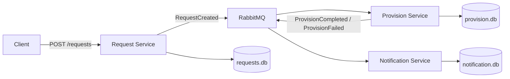
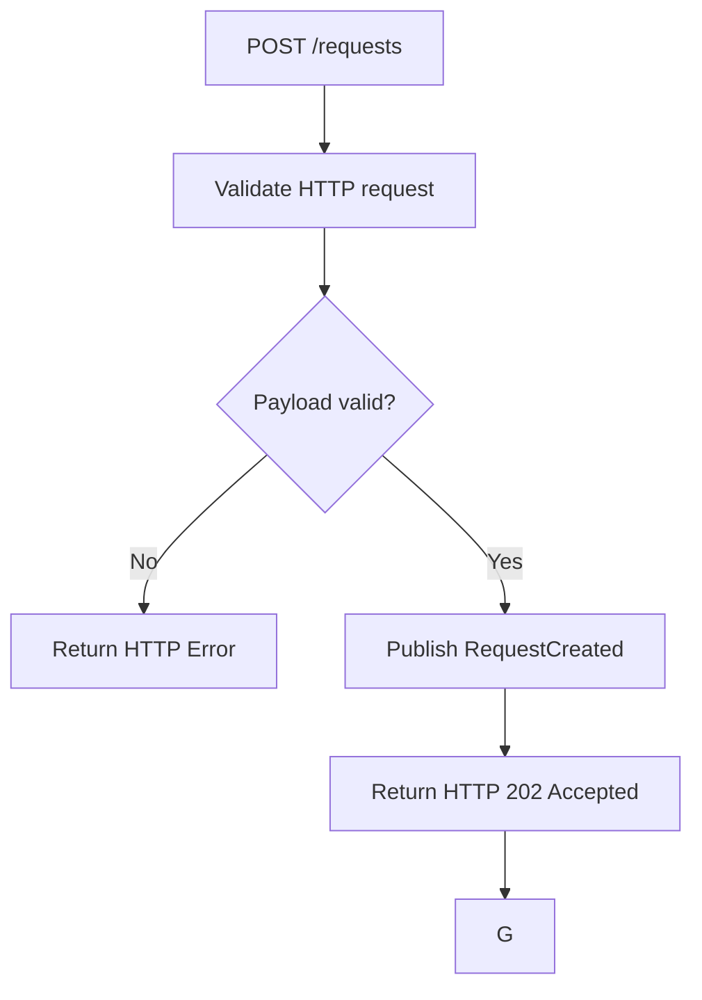
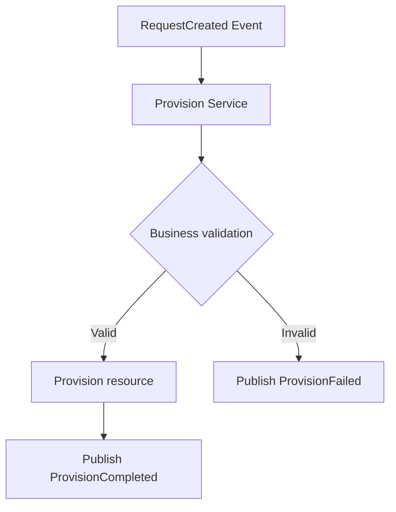
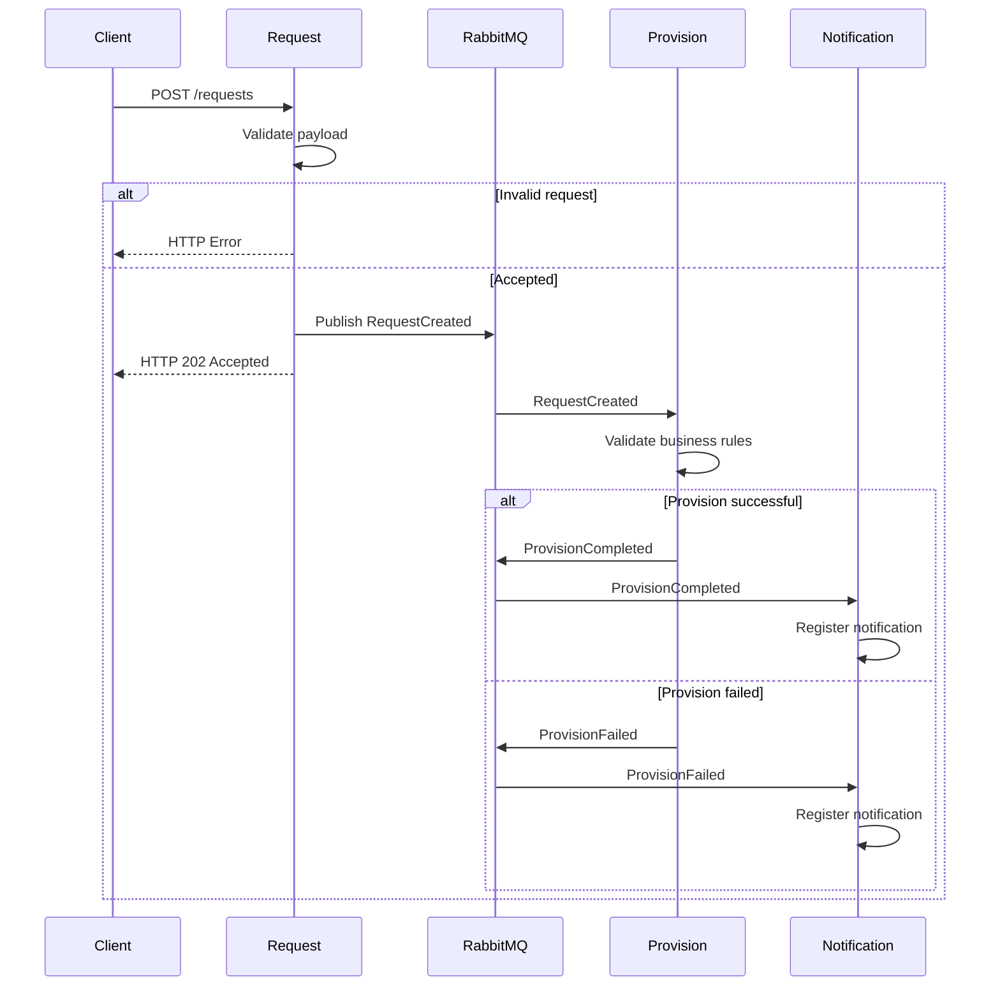
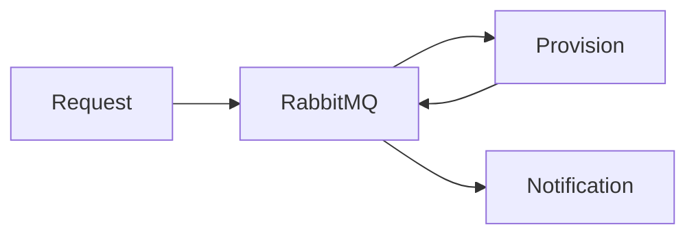
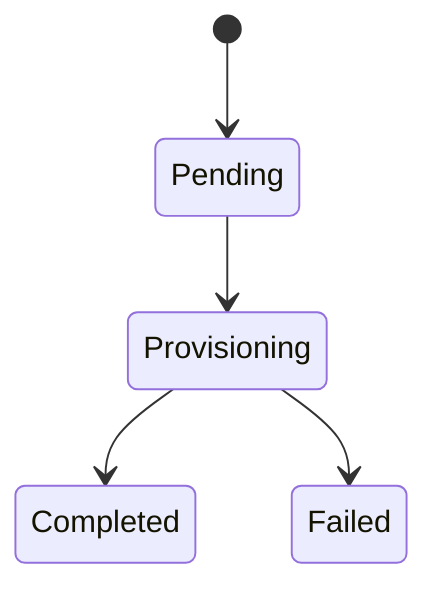

# Architecture

## Overview

The Resource Provisioning System is an asynchronous, event-driven platform designed to process cloud resource provisioning requests.

Its primary goal is to decouple request reception from resource provisioning through asynchronous messaging, allowing services to evolve independently while reducing coupling between business capabilities.

The architecture is composed of independent microservices that communicate exclusively through RabbitMQ.

Although the current implementation simulates resource provisioning, the architecture is provider-agnostic and can be extended to support multiple cloud providers without changing the Request Service.

---

# Architecture Principles

* Asynchronous communication.
* Event-driven workflow.
* Stateless service design.
* One database per microservice.
* Provider-agnostic Request Service.
* Independent service ownership.
* Container-first deployment.

---

# High-Level Architecture

---

# Request Service

The Request Service is the public entry point of the platform.

Responsibilities:

* Receive provisioning requests.
* Validate payload structure.
* Publish RequestCreated events.
* Return HTTP responses.

The Request Service does **not** perform provider-specific validation.

Provider-specific rules belong exclusively to the Provision Service.

---

# Synchronous Request Flow

The HTTP request lifecycle ends inside the Request Service.

Typical synchronous responses include:

| HTTP Code | Description                                  |
| --------- | -------------------------------------------- |
| 202       | Request accepted for asynchronous processing |
| 400       | Malformed request                            |
| 415       | Unsupported media type                       |
| 422       | Payload validation failed                    |
| 429       | Rate limit exceeded                          |
| 500       | Unexpected Request Service error             |

---

# Asynchronous Provisioning Flow

After a request has been accepted, processing becomes fully asynchronous.

Business validation includes provider-specific rules, resource configuration and provisioning constraints.

---

# Notification Flow

The Notification Service consumes provisioning events.

Responsibilities:

* Consume provisioning events.
* Register notification history.
* Persist notification records.

The Notification Service contains no provisioning logic.

---

# Complete Event Flow

---

# Service Responsibilities

| Service              | Responsibility                                                                                     |
| -------------------- | -------------------------------------------------------------------------------------------------- |
| Request Service      | Receive requests, validate payload structure, persist accepted requests and publish events.        |
| Provision Service    | Validate provider-specific business rules, simulate provisioning and publish provisioning results. |
| Notification Service | Consume provisioning events and register notifications.                                            |

---

# Data Ownership

The architecture follows the Database per Service pattern.

Each microservice is designed to own its own persistence layer, ensuring service autonomy and preventing direct database sharing.

The current implementation focuses on asynchronous communication. Dedicated persistence will be introduced as the project evolves.

---

# Design Decisions

## Why RabbitMQ?

RabbitMQ provides asynchronous communication between services, allowing each microservice to process messages independently and reducing temporal coupling.

## Why a provider-agnostic Request Service?

The Request Service validates only the request contract. Provider-specific validation belongs to the Provision Service, allowing support for multiple cloud providers without changing the public API.

## Why one database per service?

Each service owns its data model, preventing tight coupling and enabling independent evolution.

## Why asynchronous processing?

Provisioning cloud resources may involve long-running operations. Returning HTTP 202 allows the client to continue without waiting for the provisioning workflow to complete.

---

# Communication Model

Microservices communicate only through RabbitMQ.

No direct service-to-service communication is allowed.

---

# Request Lifecycle

A provisioning request is accepted synchronously and processed asynchronously.

The final state is determined only after the Provision Service completes its processing.
