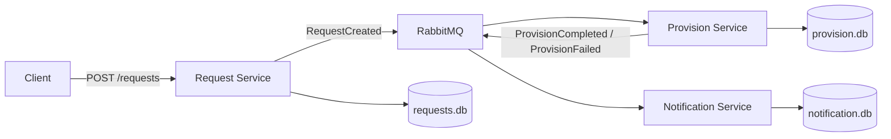
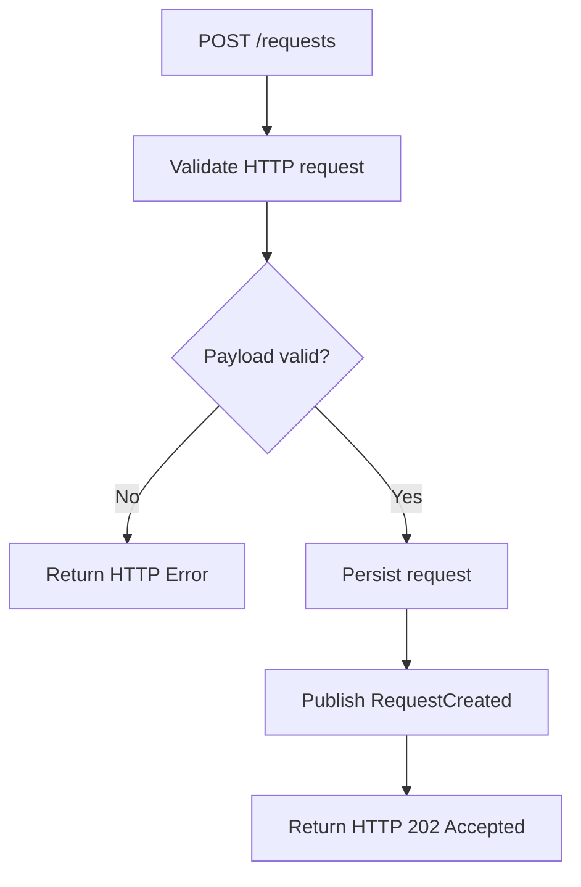
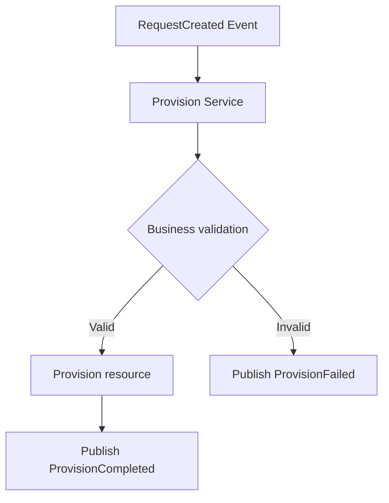
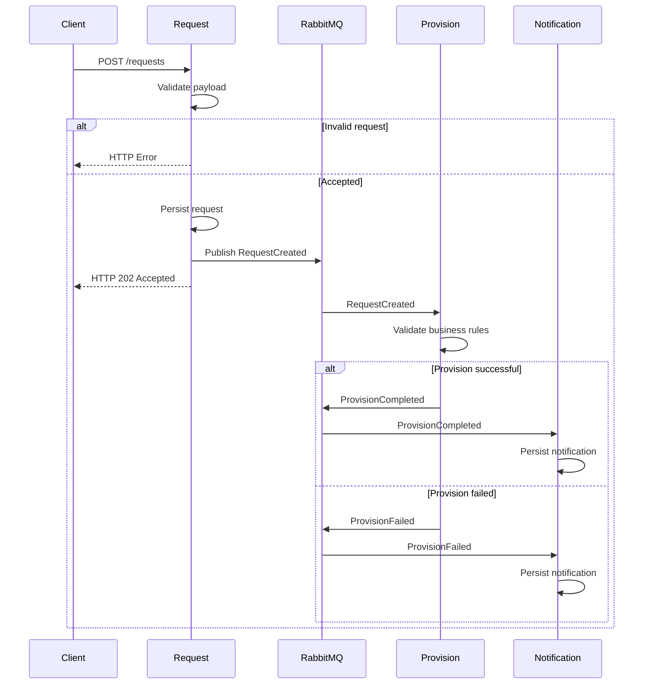
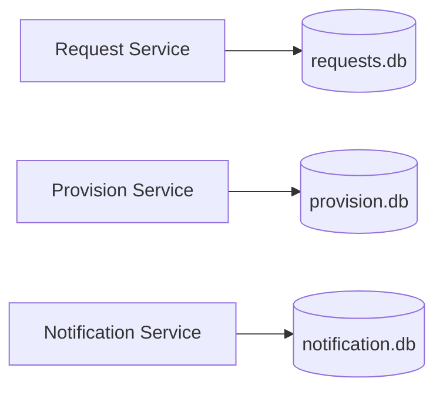
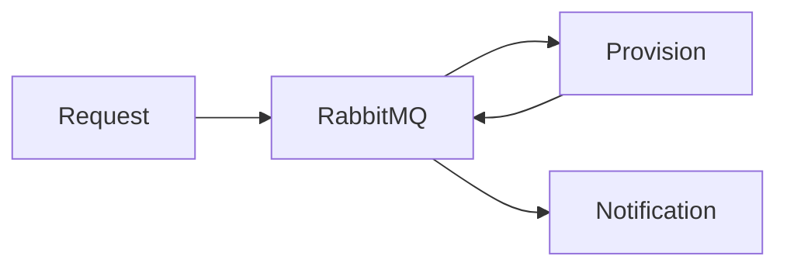
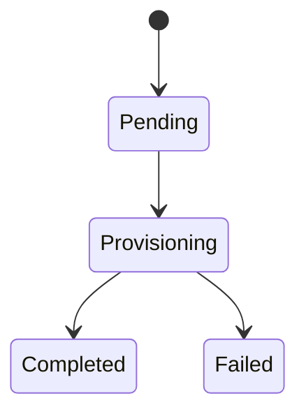

# Architecture

## Overview

The Resource Provisioning System is an asynchronous, event-driven platform designed to process cloud resource provisioning requests.

The architecture is composed of independent microservices that communicate exclusively through RabbitMQ.

Each microservice owns its own database and is responsible for a single business capability.

---

# Architecture Principles

* Asynchronous communication.
* Event-driven workflow.
* One database per microservice.
* Provider-agnostic Request Service.
* Independent service ownership.
* Docker-first deployment.

---

# High-Level Architecture

---

# Request Service

The Request Service is the public entry point of the platform.

Responsibilities:

* Receive provisioning requests.
* Validate payload structure.
* Persist accepted requests.
* Publish RequestCreated events.
* Return HTTP responses.

The Request Service does **not** perform provider-specific validation.

---

# Synchronous Request Flow

The HTTP request lifecycle ends inside the Request Service.

If the request cannot be accepted, no event is published and no request is persisted.

Typical synchronous responses include:

| HTTP Code | Description                                  |
| --------- | -------------------------------------------- |
| 202       | Request accepted for asynchronous processing |
| 400       | Malformed request                            |
| 415       | Unsupported media type                       |
| 422       | Payload validation failed                    |
| 429       | Rate limit exceeded                          |
| 500       | Unexpected Request Service error             |

---

# Asynchronous Provisioning Flow

After a request has been accepted, processing becomes fully asynchronous.

Business validation includes provider-specific rules, resource configuration and provisioning constraints.

---

# Notification Flow

The Notification Service consumes provisioning events.

Responsibilities:

* Consume provisioning events.
* Register notification history.
* Persist notification records.

The Notification Service contains no provisioning logic.

---

# Complete Event Flow

---

# Service Responsibilities

| Service              | Responsibility                                                                                     |
| -------------------- | -------------------------------------------------------------------------------------------------- |
| Request Service      | Receive requests, validate payload structure, persist accepted requests and publish events.        |
| Provision Service    | Validate provider-specific business rules, simulate provisioning and publish provisioning results. |
| Notification Service | Consume provisioning events and register notifications.                                            |

---

# Data Ownership

Each microservice owns its own persistence layer.

No service is allowed to access another service's database.

---

# Communication Model

Microservices communicate only through RabbitMQ.

No direct service-to-service communication is allowed.

---

# Request Lifecycle

A provisioning request is accepted synchronously and processed asynchronously.

The final state is determined only after the Provision Service completes its processing.
